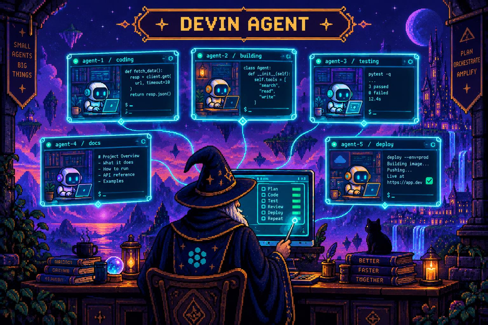

# Devin Orchestrator

<p align="center">
  
</p>

Delegate tasks to Devin agents via tmux sessions. Designed for Claude Code orchestration.

Spawn parallel coding agents, monitor their progress, send follow-up messages mid-task, and capture results - all from Claude Code or the command line.

## Installation

### As a Claude Code Plugin (Recommended)

**Step 1:** Add the marketplace:

```
/plugin marketplace add leofmarciano/devin-orchestrator
```

**Step 2:** Install the plugin:

```
/plugin install devin-orchestrator
```

**Step 3:** Restart Claude Code (may be required for the skill to load)

**Step 4:** Install the CLI and dependencies:

```
/devin-orchestrator init
```

Or say "set up devin orchestrator" and Claude will walk you through it.

**Step 5:** Use it - just ask Claude to do things. The skill activates automatically for coding tasks.

### Manual / CLI-Only Install

If you just want the `devin-agent` CLI without the Claude Code plugin:

```bash
# Prerequisites
brew install tmux              # macOS (or apt/pacman/dnf for Linux)
curl -fsSL https://cli.devin.ai/install.sh | sh   # Devin CLI
devin auth login              # Authenticate with Devin

# Install
git clone https://github.com/leofmarciano/devin-orchestrator.git ~/.devin-orchestrator
cd ~/.devin-orchestrator && bun install

# Add to PATH (add this line to ~/.bashrc or ~/.zshrc)
export PATH="$HOME/.devin-orchestrator/bin:$PATH"

# Verify
devin-agent health
```

Or use the automated installer:

```bash
bash <(curl -fsSL https://raw.githubusercontent.com/leofmarciano/devin-orchestrator/main/plugins/devin-orchestrator/scripts/install.sh)
```

### Requirements

| Dependency | Purpose | Install |
|-----------|---------|---------|
| [tmux](https://github.com/tmux/tmux) | Terminal multiplexer - agents run in tmux sessions | `brew install tmux` |
| [Bun](https://bun.sh) | JavaScript runtime - runs the CLI | `curl -fsSL https://bun.sh/install \| bash` |
| [Devin CLI](https://cli.devin.ai) | Cognition's coding agent - the thing being orchestrated | `curl -fsSL https://cli.devin.ai/install.sh \| sh` |
| Devin account | API access for Devin agents | `devin auth login` |

**Platform support:** macOS and Linux. Windows users should use WSL.

## Why?

When you're working with Claude Code and need parallel execution, investigation tasks, or long-running operations - spawn Devin agents in the background. They run in tmux sessions so you can:

- **Watch live** - Attach to any session and see exactly what the agent is doing
- **Talk back** - Send follow-up messages mid-task to redirect or add context
- **Run in parallel** - Spawn multiple agents investigating different parts of a codebase
- **Capture results** - Grab output programmatically when agents finish

Claude handles the strategic thinking (planning, synthesis, communication). Devin handles the deep coding work (research, implementation, review, testing). Together they cover both the orchestration and execution layers.

## Codebase Map (Recommended)

The `--map` flag injects `docs/CODEBASE_MAP.md` into every agent's prompt, giving them instant understanding of your entire codebase: file purposes, module boundaries, data flows, dependencies, and navigation guides.

Without a map, agents waste time exploring and guessing at structure. With a map, they know exactly where things are and start working immediately.

The map is generated by [Cartographer](https://github.com/kingbootoshi/cartographer), a companion Claude Code plugin:

```
/plugin marketplace add kingbootoshi/cartographer
/plugin install cartographer
/cartographer
```

This creates `docs/CODEBASE_MAP.md`. After that, every `devin-agent start ... --map` command gives agents full architectural context. **Generate a codebase map before using devin-orchestrator on a new project** - it's the difference between agents that fumble around and agents that execute with precision.

## Quick Start

```bash
# Start an agent
devin-agent start "Review this codebase for security vulnerabilities" --map
devin-agent start "Refactor auth module" --wait --notify-on-complete 'printf "\033[0;32mDevin agent done\033[0m\n"'

# Check status with structured JSON
devin-agent jobs --json

# See what it's doing
devin-agent capture <jobId>

# Redirect the agent mid-task
devin-agent send <jobId> "Focus on the authentication module instead"
```

## Commands

| Command | Description |
|---------|-------------|
| `start <prompt>` | Start a new agent with the given prompt |
| `status <id>` | Check job status and details |
| `send <id> <msg>` | Send a message to redirect a running agent |
| `capture <id> [n]` | Get last n lines of output (default: 50) |
| `output <id>` | Get full session output |
| `attach <id>` | Print tmux attach command |
| `watch <id>` | Stream output updates |
| `jobs` | List all jobs |
| `jobs --json` | List jobs with structured metadata (tokens, files, summary) |
| `sessions` | List active tmux sessions |
| `kill <id>` | Terminate a running job (last resort) |
| `clean` | Remove jobs older than 7 days |
| `health` | Check tmux and devin availability |

## Options

| Option | Description |
|--------|-------------|
| `-r, --reasoning <level>` | Reasoning effort: `low`, `medium`, `high`, `xhigh` |
| `-m, --model <model>` | Model family (default: swe-2) |
| `-w, --wait` | Wait for completion and emit a ping when done |
| `--notify-on-complete <cmd>` | Shell command to run when the job completes |
| `-s, --sandbox <mode>` | `read-only`, `workspace-write`, `danger-full-access` |
| `-f, --file <glob>` | Include files matching glob (repeatable) |
| `-d, --dir <path>` | Working directory |
| `--map` | Include codebase map (docs/CODEBASE_MAP.md) |
| `--strip-ansi` | Remove ANSI control codes and Devin TUI noise from output |
| `--clean` | Alias for `--strip-ansi` |
| `--json` | Output JSON (jobs command only) |
| `--dry-run` | Preview prompt without executing |

## Jobs JSON Output

Get structured job data with `jobs --json`:

```json
{
  "id": "8abfab85",
  "status": "completed",
  "elapsed_ms": 14897,
  "tokens": {
    "input": 36581,
    "output": 282,
    "context_window": 258400,
    "context_used_pct": 14.16
  },
  "files_modified": ["src/auth.ts", "src/types.ts"],
  "summary": "Implemented the authentication flow..."
}
```

## Examples

### Parallel Investigation

```bash
# Spawn multiple agents to investigate different areas
devin-agent start "Audit authentication flow" -r high --map -s read-only
devin-agent start "Review database queries for N+1 issues" -r high --map -s read-only
devin-agent start "Check for XSS vulnerabilities in templates" -r high --map -s read-only

# Check on all of them
devin-agent jobs --json
```

### Redirecting an Agent

```bash
# Agent going down wrong path? Redirect it
devin-agent send abc123 "Stop - focus on the auth module instead"

# Agent needs info? Send it
devin-agent send abc123 "The dependency is installed. Continue with typecheck."

# Attach for direct interaction
tmux attach -t devin-agent-abc123
# (Ctrl+B, D to detach)
```

### With File Context

```bash
# Include specific files in the prompt
devin-agent start "Review these files for bugs" -f "src/auth/**/*.ts" -f "src/api/**/*.ts"

# Include codebase map for orientation
devin-agent start "Understand the architecture" --map -r high
```

## How It Works

1. You run `devin-agent start "task"`
2. It creates a detached tmux session
3. It launches the Devin CLI inside that session
4. It sends your prompt to Devin
5. It returns immediately with the job ID
6. Devin works in the background
7. You check with `jobs --json`, `capture`, `output`, or `attach`
8. You redirect with `send` if the agent needs course correction

All session output is logged via the `script` command, so results are available even after the session ends. Session metadata is parsed from Devin's JSONL files (`~/.devin/sessions/`) to extract tokens, file modifications, and summaries.

## The Claude Code Plugin

When installed as a Claude Code plugin, the **devin-orchestrator skill** teaches Claude how to use the CLI automatically. Claude becomes the orchestrator:

- Breaks your requests into agent-sized tasks
- Spawns agents with the right flags (read-only for research, workspace-write for implementation)
- Monitors agent progress
- Synthesizes findings from multiple agents
- Course-corrects agents that drift off-task

This means you can just describe what you want, and Claude handles the delegation.

The skill follows a pipeline: **Ideation -> Research -> Synthesis -> PRD -> Implementation -> Review -> Testing**. Each stage uses the appropriate agent configuration.

See [plugins/devin-orchestrator/README.md](plugins/devin-orchestrator/README.md) for full plugin documentation.

## Job Storage

```
~/.devin-agent/jobs/
  <jobId>.json    # Job metadata
  <jobId>.prompt  # Original prompt
  <jobId>.log     # Full terminal output
```

## Tips

- Use `devin-agent send` to redirect agents - don't kill and respawn
- Use `jobs --json` to get structured data (tokens, files, summary) in one call
- Use `--strip-ansi` (or `--clean`) to get parse-friendly output with ANSI and TUI chrome removed
- Use `-r xhigh` for complex tasks that need deep reasoning
- Use `--map` to give agents codebase context (requires docs/CODEBASE_MAP.md)
- Use `-s read-only` for research tasks that shouldn't modify files
- Kill stuck jobs with `devin-agent kill <id>` only as a last resort

## License

Based on https://github.com/kingbootoshi/codex-orchestrator by @kingbootoshi

MIT
